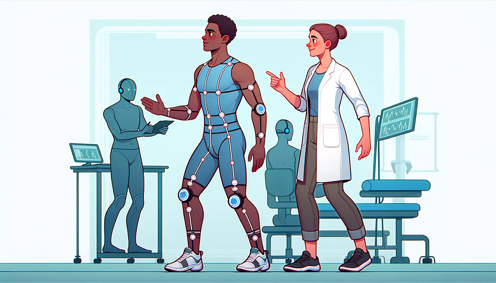

# AI Physiotherapy Motion Tracking Application



A Next.js web application that uses AI-powered motion tracking to provide real-time feedback on physiotherapy exercises. The application helps users perform exercises with proper form through computer vision technology.

## Table of Contents

- [Features](#features)
- [Architecture](#architecture)
- [Technology Stack](#technology-stack)
- [Getting Started](#getting-started)
- [Project Structure](#project-structure)
- [Adding New Exercises](#adding-new-exercises)
- [Deployment](#deployment)
- [Contributing](#contributing)
- [Browser Compatibility](#browser-compatibility)
- [License](#license)

## Features

- **Exercise Selection**: Browse and filter exercises by category, difficulty, and search
- **Detailed Instructions**: Clear guidance on how to perform each exercise
- **Real-time Motion Tracking**: Uses MediaPipe Pose to track body movements
- **Form Analysis**: AI-powered analysis of exercise form with specific feedback
- **Visual Feedback**: Immediate alerts for incorrect movements
- **Progress Tracking**: Monitor improvement over time with performance metrics
- **Responsive Design**: Works on desktop, tablet, and mobile devices

## Architecture

The application follows a component-based architecture with React hooks for state management:


### Core Components

- **Camera Integration**: Access to device camera through browser APIs
- **Pose Detection**: Integration with MediaPipe for skeletal tracking
- **Motion Analysis**: Custom algorithms for exercise-specific movement analysis
- **Feedback System**: Real-time form correction and guidance
- **Data Persistence**: Local storage for tracking progress over time

### Data Flow

1. User selects an exercise from the library
2. Camera feed is established and pose detection is initialized
3. Motion analyzer compares real-time pose with exercise requirements
4. Form issues are identified and immediate feedback is provided
5. Exercise data is recorded and stored for progress tracking

## Technology Stack

- **Framework**: Next.js (React)
- **Motion Tracking**: MediaPipe Pose
- **State Management**: React Hooks
- **Styling**: CSS Modules
- **Data Persistence**: LocalStorage API
- **Deployment**: Vercel (recommended)

## Getting Started

### Prerequisites

- Node.js 14.x or later
- npm or yarn
- A device with a camera
- A modern web browser (Chrome, Firefox, Edge, or Safari)

### Installation

1. Clone the repository:
   ```bash
   git clone https://github.com/your-username/physiotherapy-ai-app.git
   cd physiotherapy-ai-app

npm install
# or
yarn install

mkdir -p public/assets/exercises
# Add placeholder images as needed


npm run dev
# or
yarn dev

